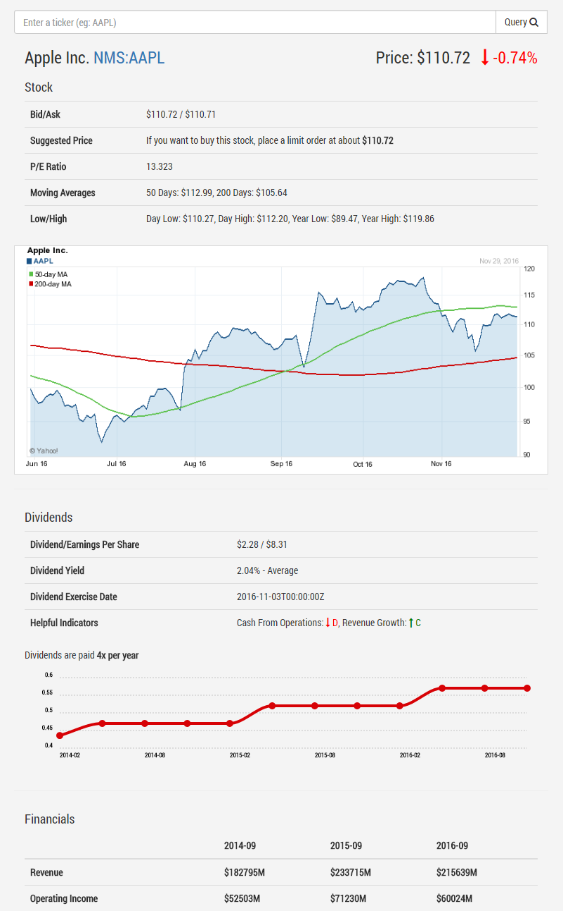

# Stock Explorer
Stock Explorer is a simple request/response html/js client and a small service written in go which allows exploring various stock tickers. This is connected to Yahoo Finance in order to retrieve the data and uses [emitter.io](https://emitter.io) publish/subscribe api to make client talk to the server (see [emitter on GitHub](https://github.com/emitter-io/emitter).

